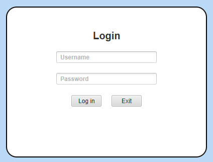
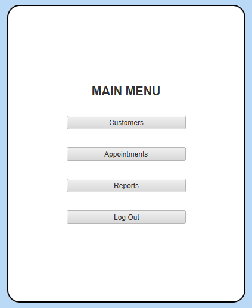

# Java CRM

## Description
This Java application is a comprehensive Customer Relationship Management (CRM) system designed to streamline customer data management, appointment scheduling, and report generation. It allows users to add, update, and delete customer records, organize appointments within a calendar, and run detailed analytics on appointment data.

Developed as part of an Advanced Java Concepts project at WGU, this application demonstrates advanced skills in database and file server application development. Key features include:
- **Lambda Expressions**: Simplifying code and enhancing performance.
- **Advanced Exception Handling**: Providing a stable and user-friendly experience.
- **Localization and Date/Time APIs**: Supporting users across various geographical regions.
- **Streams and Filters**: Enabling efficient data manipulation and processing.

## Installation

### Prerequisites:
- Download and install [Java Runtime Environment (JRE) 8](https://www.oracle.com/java/technologies/javase-jre8-downloads.html) or higher.

### Steps:
1. Ensure that the prerequisite applications are installed.
2. Download the [dist.zip file](dist.zip).
3. Extract the files from the ZIP archive.
4. Run the `java-crm.jar` file to launch the application.

## Using the Application
The login screen will appear upon starting the application.

Enter your credentials and click the “Login” button. Once logged in, the menu will appear.

Use the buttons to navigate to other screens where you can view/manage customers, appointments, or reports.

## Future Improvements
Here are some planned enhancements to make the application even better:
- **Accessibility**: Optimize colors and fonts for better accessibility.
- **Reports Design**: Improve the design and usability of the reports screen.
- **Report Downloads**: Add functionality to download and save reports.
- **Localization Testing**: Include a section in the README for testing localization settings.
- **Detailed Documentation**: Expand the "Using the Application" section with more detailed explanations of screenshots, required fields, and input validation.

## Project Status
This project was developed as part of an EazyByts Infotech Full Stack Java Developer Internship assignment.

---

Coded by - Vishvendra Singh
