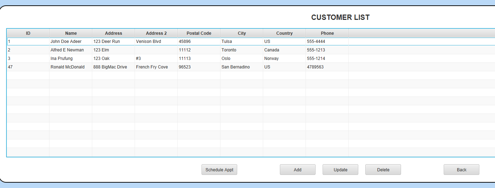
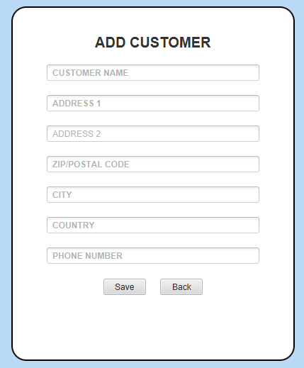
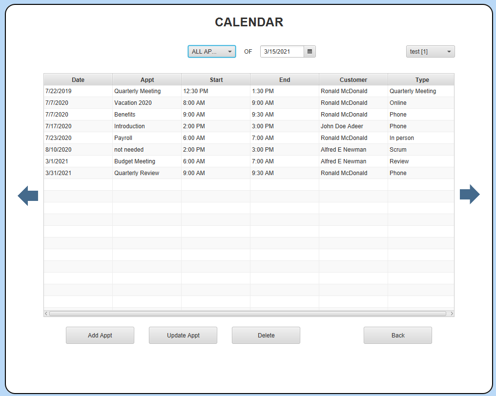
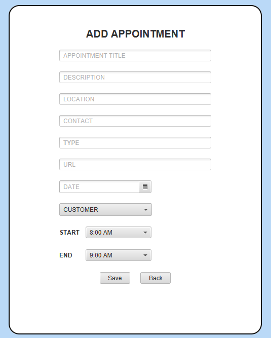
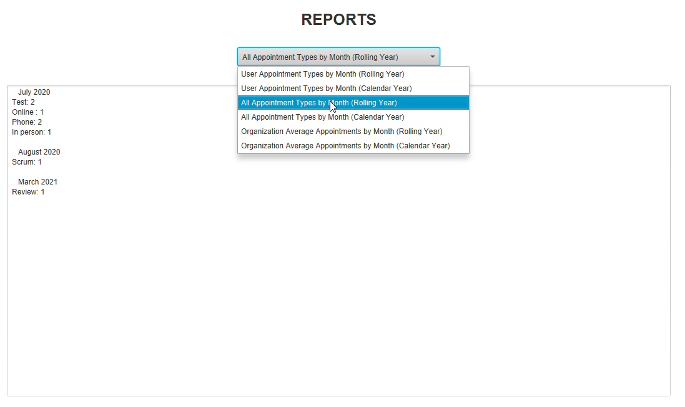

# Java CRM

## Description
This Java application is a comprehensive Customer Relationship Management (CRM) system designed to streamline customer data management, appointment scheduling, and report generation. It allows users to add, update, and delete customer records, organize appointments within a calendar, and run detailed analytics on appointment data.

Developed as part of an Advanced Java Concepts project at WGU, this application demonstrates advanced skills in database and file server application development. Key features include:
- **Lambda Expressions**: Simplifying code and enhancing performance.
- **Advanced Exception Handling**: Providing a stable and user-friendly experience.
- **Localization and Date/Time APIs**: Supporting users across various geographical regions.
- **Streams and Filters**: Enabling efficient data manipulation and processing.

## Installation

### Prerequisites:
- Download and install [Java Runtime Environment (JRE) 8](https://www.oracle.com/java/technologies/javase-jre8-downloads.html) or higher.

### Steps:
1. Ensure that the prerequisite applications are installed.
2. Download the [dist.zip file](dist.zip).
3. Extract the files from the ZIP archive.
4. Run the `java-crm.jar` file to launch the application.

## Using the Application
Upon starting the application, the login screen will be the first interface you encounter.

1. **Login**: Enter your credentials and click the “Login” button. If the credentials are correct, the main menu will be displayed.

2. **Navigation**: Use the buttons on the menu to navigate to different sections of the application:
   - **Customers**: View, add, update, or delete customer records.
   - **Appointments**: Manage your schedule by viewing, adding, or editing appointments.
   - **Reports**: Generate and view reports based on appointment data.

### Screenshots and Features:
- **View Customers**: A comprehensive list of all customers with options to update or delete records.

- **Add Customer**: A form to input new customer details, with validation to ensure required fields are completed.

- **View Appointments**: A calendar view to manage and track all scheduled appointments.

- **Add Appointment**: A form to schedule new appointments, including customer selection and time/date settings.

- **Reports**: Various analytical reports based on customer and appointment data to help make informed decisions.

## Future Improvements
Here are some planned enhancements to make the application even better:
- **Accessibility**: Optimize colors and fonts for better accessibility.
- **Reports Design**: Improve the design and usability of the reports screen.
- **Report Downloads**: Add functionality to download and save reports.
- **Localization Testing**: Include a section in the README for testing localization settings.
- **Detailed Documentation**: Expand the "Using the Application" section with more detailed explanations of screenshots, required fields, and input validation.

## Project Status
This project was developed for an academic course and is not planned for further development at this time.

---

Coded by - Vishvendra Singh
